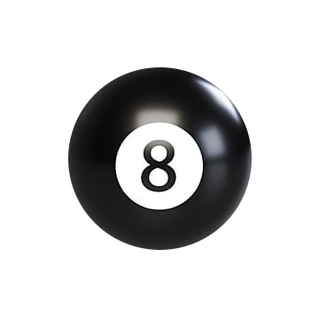
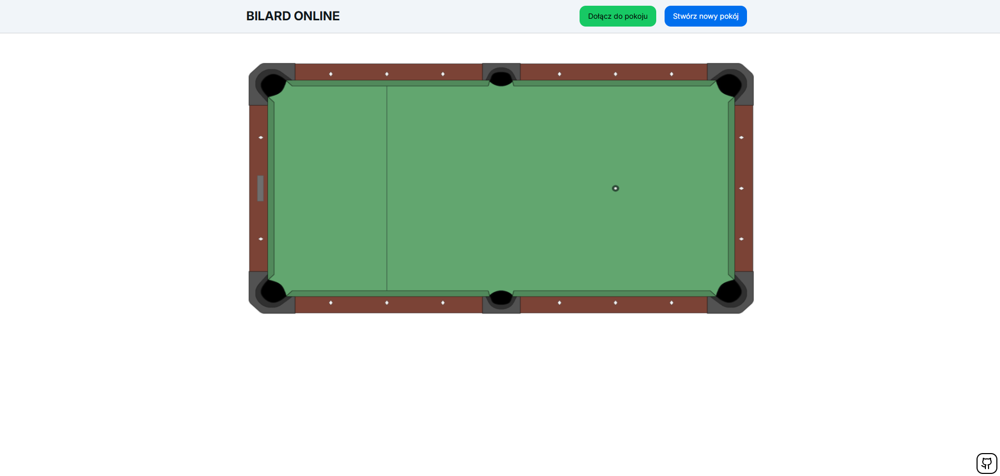
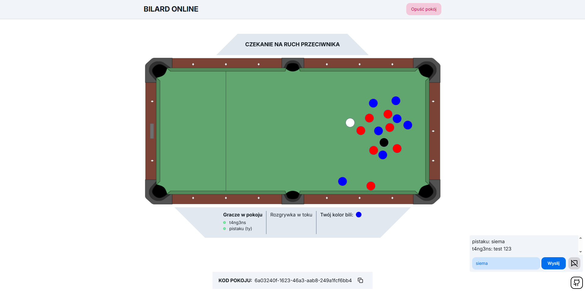

  

  <h3>Billard online game</h3>
  
Strona umożliwiająca grę w billarda w dwu-osobowym pokoju

  
  ## O stronie

   Na stronie można:
  * Grać 1v1 z inną osobą na świecie
  * Pisać na czacie w czasie rzeczywistym

  
  
  
## Aplikacja zbudowana za pomocą

* 
* 
* 
* 
* 

Linki do grafik widniejących w aplikacji
* https://pngtree.com/freepng/billiard-black-eighth-ball-isolated-on-transparent-background_5324882.html
* https://en.m.wikipedia.org/wiki/File:American-style_pool_table_diagram_%28empty%29.png
